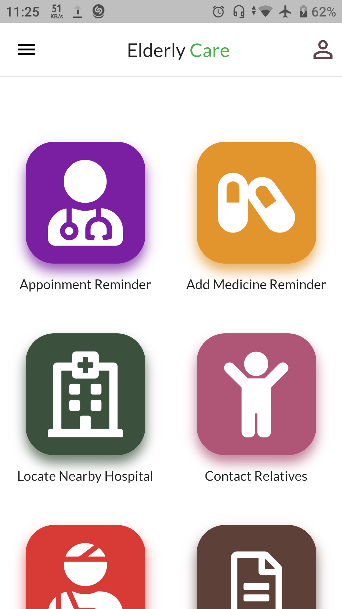
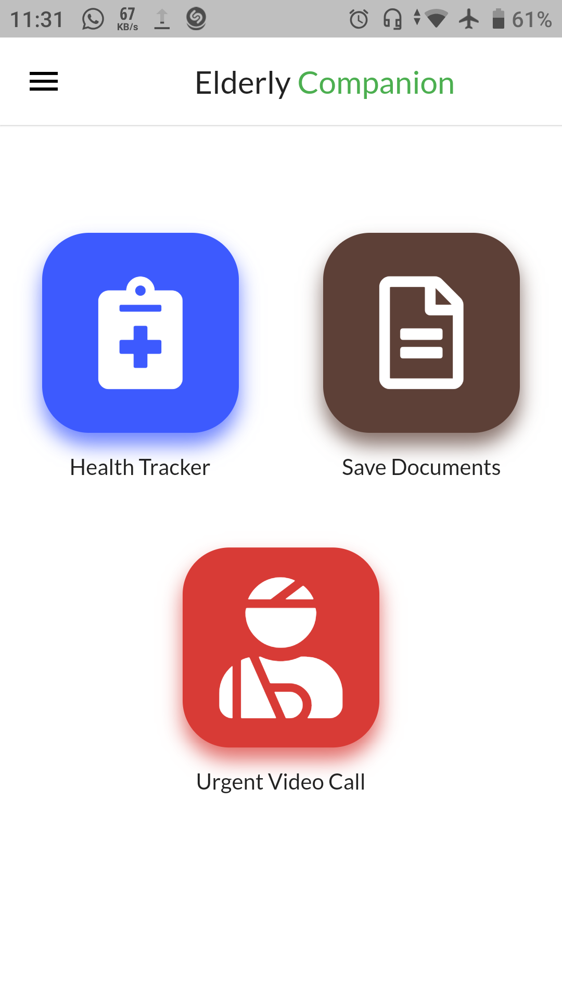
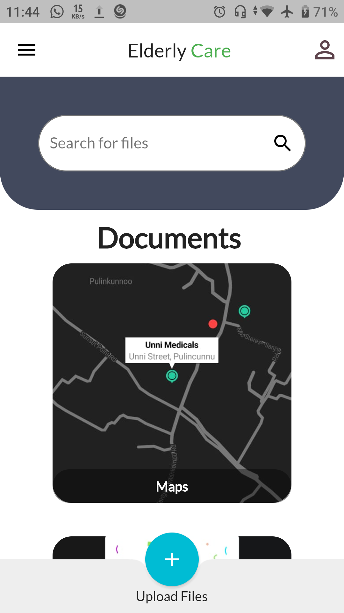
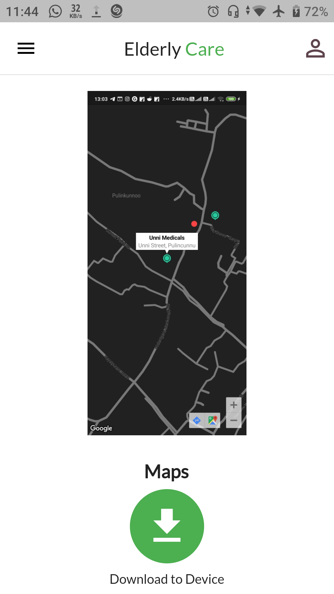
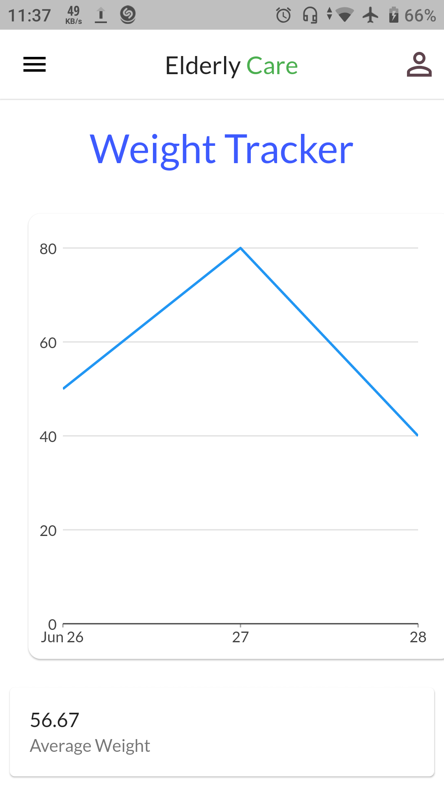
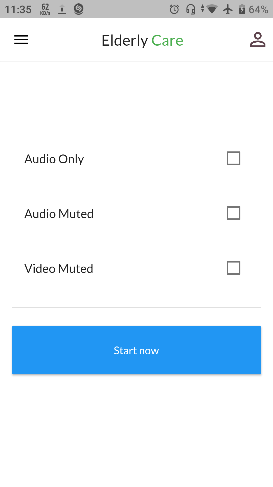
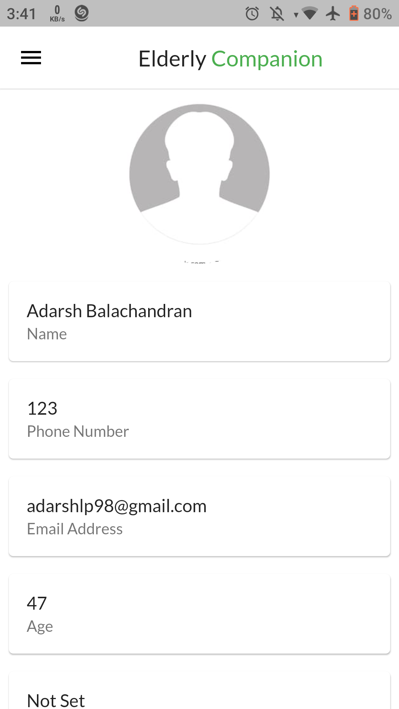
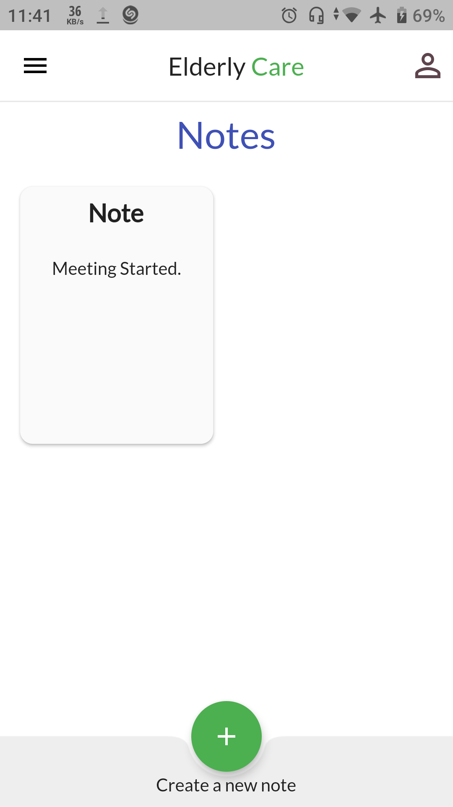

# Elderly Care<!-- -->
<!--

-->

Easiest way to manage your health, medicines, emergencies all in one place.

## Download the App

 
The app is heavy as it is the profile apk due to some issue with the release build.

## About

The app provides a reminder for the elderly for their daily medications, shows nearby hospitals,  an option to alert emergency contacts, sos button for fetching the number of nearby hospital in case of emergency, option to add important notes based on their priority, option to add doctor appointment reminder and alert emergency contacts regarding the same, helps in tracking the person's important health vitals, to organise documents in one place.There is a companion app for Caretakers to monitor the data from health trackers,to view documents,emergency video call and more. Find the companion app here : [Elderly Companion](https://github.com/adarshbalu/elderly_companion) app.

## Features

- Medicine Reminder
  - Reminder for the elderly to stay on schedule for their daily medicines.
  - The reminder hits an alarm and requests for confirmation if the person hastaken the specific medicine at the times prescribed. 
  - If not responded to,or responded negatively,the app sends a notification to the point of contact.

- Alert Emergency contacts with location
  - Feature that shares your current location to all emergency contacts in case you want them to reach you as soon as possible. Helps accessing you in emergency, or to coordinate care.

- Locate nearby Hospitals
  - This feature help in locating all your nearby hospitals in your current location providing information on the distances and      directions for you.

- Emergency Video Call
  - Helps you to connect with loved ones on emergency needs.

- Doctor Appointments
  - Helps in keeping track of doctor appointments through reminders.
  - It will also inform the point of contact giving the details of the appointment.

- Notes
  - Person can enter all important notes and to record observations in the app itself. 
  - Notes will be arranged in the priority specified.

- Track
  - This feature helps the person to track progress his important health vitals such as sleep, weight, blood pressure, sugar level etc.   - A graphical representation of each would be provided based on the regular data.

- Document Storage
  - Helps in organising all personal documents you are challenged manage - from all personal IDs and journals to medical contacts and    insurance informations. Secure upload and storage.
  
## Technologies Used
- Firebase - Authentication,Firestore,Storage
- SqfLite Database - Offline Storage
- Shared Preferences
- Jisti Meet - Video call
- TomTom API - Routing and Navigation
- OpenCage API - Location information

## Screenshots

### Home Screen

###  Documents

### Tracker

### Video call

### Profile

### Notes

## Permissions

On Android versions prior to Android 6.0, Elderly Care requires the following permissions:

- Full Network Access: It uses the network data for the firebase.

- Storage space:For storing all the datas such as documents, notes and reminders.
  
- Message and Call: Permission required for alerting relatives and to contact hospitals.

- Access Current Location: Current location access required for informing the point of contact.

## Contributing

Elderly Care app is a free and open source project. Any contributions are welcome. Here are a few ways you can help:
 * [Report bugs and make suggestions.](https://github.com/adarshbalu/elderly_app/issues)
 

## Credits  

<!--Thanks to  Wanicon (https://flaticon.com/authors/wanicon) for the app icon.-->

## License

This application is released under GNU GPLv3 (see [LICENSE](LICENSE)).
Some of the used libraries are released under different licenses.
